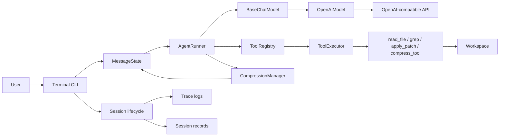

# codingAgent

[English](README.md) | [简体中文](README.zh-CN.md)


> A dependency-free, learning-oriented coding agent built from first principles in Python.

`codingAgent` is a small but complete terminal coding agent. It implements the essential agent loop, native tool calling, workspace-safe file operations, context compression, logging, session recording, and real-LLM evaluations without relying on an agent framework.

This repository makes the mechanics of a coding agent visible and understandable. It is a learning project rather than a production-ready framework.

## Highlights

| Capability | What is implemented |
| --- | --- |
| Agent loop | Repeated model → tool → model execution with a configurable round limit |
| Model integration | Non-streaming OpenAI-compatible Chat Completions adapter |
| Native tool calling | Provider-independent tool contracts and OpenAI tool-call conversion |
| Coding tools | `read_file`, `grep`, and multi-file `apply_patch` with full preflight validation |
| Context management | Automatic conversation summarization and model-triggered tool-output compression |
| Workspace safety | Path containment, protected-path rules, and preflight patch validation |
| Observability | Per-run trace logs and structured Markdown session records |
| Evaluation | Unit tests plus real-LLM long-context and compression A/B benchmarks |
| Runtime | Python standard library only |

## Architecture



The implementation separates domain contracts from infrastructure:

- `AgentRunner` owns one user turn and is independent of the concrete provider.
- Internal message classes normalize provider-specific request and response formats.
- `BaseChatModel`, `BaseTool`, `BaseToolCallAdapter`, and `BaseHttpClient` define dependency boundaries.
- `composition/` is the composition root that wires concrete implementations together.
- Context planning and git-diff application are isolated from I/O so they can be tested directly.

## How One Turn Works

1. The CLI appends a `UserMessage` to the in-memory `MessageState`.
2. `CompressionManager` checks the estimated active-context budget.
3. `AgentRunner` sends model-visible messages and tool definitions to the model.
4. If the model returns tool calls, `ToolExecutor` runs them locally.
5. Tool results are appended as `ToolMessage` objects and returned to the model.
6. The loop continues until the model returns a normal assistant response or reaches the configured round limit.

## Quick Start

### Requirements

- Python 3.9+
- An API that implements the OpenAI-compatible `/chat/completions` contract

### Run from source

```bash
git clone https://github.com/Gai-shi/codingAgent.git
cd codingAgent

cat > .env <<'EOF'
OPENAI_API_KEY="your-api-key"
OPENAI_MODEL="your-model"
OPENAI_BASE_URL="https://api.openai.com/v1"
EOF

python3 -m ai_job --workspace /path/to/target/project
```

The repository-level `.env` file is loaded automatically. Existing shell environment variables take precedence over values in `.env`.

### Optional editable installation

```bash
python3 -m pip install -e .
ai-job --workspace /path/to/target/project
```

The default workspace is the directory from which the command is launched.

### CLI controls

| Input or flag | Behavior |
| --- | --- |
| `-w, --workspace PATH` | Set the workspace available to file tools |
| `--disable-compress-tool` | Hide `compress_tool` for comparison evaluations |
| `/context` | Print the current model-visible message history |
| `exit`, `quit`, `et`, `Ctrl-D` | Exit the CLI |

## Configuration

| Environment variable | Required | Default | Purpose |
| --- | --- | --- | --- |
| `OPENAI_API_KEY` | Yes | — | Bearer token sent to the model API |
| `OPENAI_MODEL` | Yes | — | Model name |
| `OPENAI_BASE_URL` | No | `https://api.openai.com/v1` | OpenAI-compatible API base URL |
| `AI_JOB_TIMEOUT_SECONDS` | No | `90` | HTTP request timeout |
| `AI_JOB_MAX_TOOL_ROUNDS` | No | `8` | Maximum model/tool rounds per user turn |
| `AI_JOB_CONTEXT_WINDOW` | No | Model registry or `800000` fallback | Explicit context-window override |
| `AI_JOB_COMPACTION_RESERVE_TOKENS` | No | `16384` | Tokens reserved before automatic compression |
| `AI_JOB_COMPACTION_KEEP_RECENT_TOKENS` | No | `20000` | Recent-context budget preserved during compression |
| `AI_JOB_SYSTEM_PROMPT` | No | Built-in coding-agent prompt | Custom system instruction |
| `FILTER_TERMINAL_LOG_LEVEL` | No | `debug` | Terminal filter: `debug`, `info`, `warn`, `error`, or `none` |
| `AI_JOB_TRACE_LOG_PATH` | No | `.ai_job/logs/log.log` base path | Override the trace-log base path |
| `AI_JOB_SESSION_RECORD_PATH` | No | `.ai_job/sessions/sessions.md` base path | Override the session-record base path |

Numeric configuration values are validated at startup and must be positive.

## Built-in Tools

### `read_file`

Reads a UTF-8 text file inside the workspace.

```text
read_file(path: string) -> string
```

### `grep`

Searches workspace text files using a Python regular expression.

```text
grep(
  pattern: string,
  path?: string,
  type?: string,
  include_protected?: boolean
) -> string
```

- Supports an optional directory and file-extension filter.
- Returns at most 50 matches.
- Searching hidden or protected directories requires explicit interactive approval.

### `apply_patch`

Applies a supported subset of unified git diff patches.

```text
apply_patch(patch: string) -> string
```

- Supports modifying, creating, and deleting UTF-8 text files.
- Prechecks every affected file before writing anything.
- Locates hunks by uniquely matching old content instead of trusting line numbers.
- Rejects ambiguous matches, path escapes, renames, copies, binary patches, and quoted paths.

### `compress_tool`

Replaces large earlier tool outputs in future model-visible context with concise, model-written replacements while retaining the original raw history for recording and debugging.

It is intended for outputs whose important facts are known. It should not replace diffs, stack traces, test failures, or other details that may still require exact inspection.

## Context Management

The project implements two complementary compression mechanisms.

### Automatic conversation compression

Before each model request, the active context is estimated with a lightweight character-based token heuristic. When it crosses:

```text
context window - reserved tokens
```

the agent asks the configured model to summarize older messages while preserving a recent message window. The summary becomes the new visible context boundary; the raw message history remains available to the process and session recorder.

### Tool-output compression

The model can call `compress_tool` to replace verbose previous tool results with smaller context-visible representations. Compression calls are hidden from later model context after they succeed, avoiding self-generated bookkeeping noise.

These mechanisms are deliberately separate: one controls conversation growth globally, while the other removes local tool-output bulk before global compaction becomes necessary.

## Workspace Safety

All file-oriented tools resolve paths against a single workspace root.

- Paths that escape the workspace are rejected.
- `.env`, `.git/`, `.venv/`, `.ai_job/`, and `__pycache__/` are protected.
- `read_file` and `apply_patch` always reject protected paths.
- `grep` skips protected paths by default and requires user approval for an explicit protected search.
- Multi-file patches complete parsing, path validation, reads, and in-memory application before the first write.

While the model or tools are busy, the CLI suppresses terminal echo and discards accidentally typed input. Echo is temporarily restored when user approval is required.

## Logs and Session Records

Each CLI run creates:

```text
.ai_job/logs/log-YYYYMMDD-HHMMSS-mmm.log
.ai_job/sessions/sessions-YYYYMMDD-HHMMSS-mmm.md
```

Trace logs capture agent rounds and tool execution. Session records capture the system message, user and assistant messages, tool calls, tool results, and exit snapshots. Matching records older than one calendar month are cleaned asynchronously.

Session files are observability artifacts; they are not yet used to resume a previous conversation.

## Project Structure

```text
ai_job/
├── agent/                 # Agent loop, visibility rules, token estimation
├── communication/         # Provider-independent message model
├── composition/           # Runtime object assembly
├── compress/              # Automatic context-compression planning
├── infra/
│   ├── env/               # Typed environment loading
│   ├── http/              # Injectable HTTP client
│   ├── logging/           # Trace logging
│   └── session_recording/ # Markdown session records
├── provider_adapters/     # Chat-model contracts and OpenAI adapter
├── terminal_input/        # Terminal echo modes
├── tool_adapters/         # Provider tool-call conversion
└── tools/                 # Tool contracts and built-in tools

evals/                     # Real-LLM evaluation suites
tests/                     # Unit and integration tests
```

## Testing

```bash
python3 -m unittest discover -s tests -v
```

The tests cover the agent loop, tool contracts, file safety, patch parsing/application, provider adapters, HTTP behavior, context planning, compression, CLI composition, logging, terminal modes, and session lifecycle.

## Real-LLM Evaluations

The evaluation suites call real models rather than mocks. They can consume API credits and take substantially longer than unit tests.

### Long-context retention

`evals/context_compression_e2e/` builds a noisy multi-turn coding task whose final implementation depends on constraints introduced much earlier in the conversation.

```bash
python3 evals/context_compression_e2e/run_ai_job.py \
  --output /tmp/ai_job_context_e2e \
  --force
```

### `compress_tool` A/B pressure suite

`evals/compress_tool_pressure_e2e/` compares the same natural coding tasks with `compress_tool` enabled and disabled across multiple pressure levels and prompting policies.

```bash
python3 evals/compress_tool_pressure_e2e/run_ai_job_ab.py \
  --output /tmp/ai_job_compress_tool_ab \
  --force \
  --pressure smoke
```

Each suite includes an external grader, so the result measures final repository correctness rather than whether the model merely produced a plausible response.

## Design Principles

- **Make the loop explicit.** Core agent behavior should be readable without framework indirection.
- **Depend on contracts.** Provider, HTTP, tool, and protocol-specific behavior sit behind small interfaces.
- **Keep internal state provider-independent.** OpenAI request shapes are adapters, not domain objects.
- **Validate before side effects.** File operations reject unsafe or partially applicable changes before writing.
- **Evaluate outcomes.** Long-context behavior is checked through generated repositories and external graders.

## Known Limitations

- Only the non-streaming Chat Completions flow is implemented.
- The built-in provider adapter targets OpenAI-compatible tool-calling semantics.
- Conversation state lives in memory; session records cannot yet be resumed.
- Token counting uses a `characters / 4` estimate rather than a model tokenizer.
- `apply_patch` intentionally supports only a constrained git-diff subset.
- There is no sandbox beyond workspace path policy; tools execute in the local process.

## Repository Intent

The primary goal is to learn how coding agents work by implementing their essential parts directly: context engineering, agent loops, tool contracts, compression, evaluation, and object-oriented dependency boundaries.

For an engineering review, the most relevant entry points are:

- `ai_job/agent/agent_runner.py`
- `ai_job/communication/messages.py`
- `ai_job/tools/base_tool.py`
- `ai_job/compress/context_compression.py`
- `ai_job/composition/cli_factory.py`
