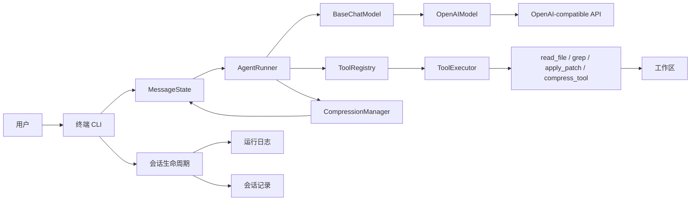

# codingAgent

[English](README.md) | [简体中文](README.zh-CN.md)


> 一个使用 Python、从第一性原理实现、零运行时第三方依赖的学习型 coding agent。

`codingAgent` 是一个小而完整的终端 coding agent。它不依赖现成的 Agent 框架，直接实现了 agent loop、原生工具调用、工作区文件操作、上下文压缩、日志与会话记录，以及基于真实大模型的端到端评测。

这个仓库的目标是让 coding agent 的核心机制可见、可理解，而不是把它包装成一个生产级 Agent 框架。

## 核心能力

| 能力 | 当前实现 |
| --- | --- |
| Agent loop | 模型 → 工具 → 模型的多轮执行，可配置最大轮数 |
| 模型接入 | 非流式 OpenAI-compatible Chat Completions 适配器 |
| 原生工具调用 | 与 provider 解耦的工具契约及 OpenAI tool-call 转换 |
| 编码工具 | `read_file`、`grep`、支持多文件完整写入前预检的 `apply_patch` |
| 上下文管理 | 自动会话摘要和由模型主动触发的工具输出压缩 |
| 工作区安全 | 路径边界、保护路径和 patch 写入前完整校验 |
| 可观测性 | 每次运行独立的 trace 日志和 Markdown 会话记录 |
| 评测 | 单元测试，以及基于真实大模型的长上下文与压缩 A/B 评测 |
| 运行时 | 仅使用 Python 标准库 |

## 架构



实现中刻意将领域契约与基础设施分离：

- `AgentRunner` 负责执行一个用户回合，不依赖具体模型 provider。
- 内部消息类型统一不同 provider 的请求和响应格式。
- `BaseChatModel`、`BaseTool`、`BaseToolCallAdapter` 和 `BaseHttpClient` 构成依赖边界。
- `composition/` 是组合根，集中装配具体实现。
- 上下文规划和 git diff 应用逻辑与 I/O 分离，可以直接测试。

## 一个回合如何执行

1. CLI 将 `UserMessage` 写入内存中的 `MessageState`。
2. `CompressionManager` 检查当前模型可见上下文是否接近预算上限。
3. `AgentRunner` 将消息历史和工具定义发送给模型。
4. 如果模型返回工具调用，`ToolExecutor` 在本地执行工具。
5. 工具结果以 `ToolMessage` 追加到历史，并重新发送给模型。
6. 直到模型返回普通文本，或工具调用轮数达到上限，本回合结束。

## 快速开始

### 环境要求

- Python 3.9+
- 实现 OpenAI-compatible `/chat/completions` 契约的模型 API

### 从源码运行

```bash
git clone https://github.com/Gai-shi/codingAgent.git
cd codingAgent

cat > .env <<'EOF'
OPENAI_API_KEY="your-api-key"
OPENAI_MODEL="your-model"
OPENAI_BASE_URL="https://api.openai.com/v1"
EOF

python3 -m ai_job --workspace /path/to/target/project
```

程序会自动读取仓库根目录下的 `.env`。如果同名变量已经存在于 shell 环境中，则 shell 环境变量优先。

### 可选：以 editable 模式安装

```bash
python3 -m pip install -e .
ai-job --workspace /path/to/target/project
```

如果不传 `--workspace`，默认工作区是启动命令时的当前目录。

### CLI 操作

| 输入或参数 | 行为 |
| --- | --- |
| `-w, --workspace PATH` | 指定文件工具可访问的工作区 |
| `--disable-compress-tool` | 隐藏 `compress_tool`，用于对比评测 |
| `/context` | 打印当前模型可见的消息历史 |
| `exit`、`quit`、`et`、`Ctrl-D` | 退出 CLI |

## 配置

| 环境变量 | 必填 | 默认值 | 用途 |
| --- | --- | --- | --- |
| `OPENAI_API_KEY` | 是 | — | 发送给模型 API 的 Bearer Token |
| `OPENAI_MODEL` | 是 | — | 模型名称 |
| `OPENAI_BASE_URL` | 否 | `https://api.openai.com/v1` | OpenAI-compatible API 根地址 |
| `AI_JOB_TIMEOUT_SECONDS` | 否 | `90` | HTTP 请求超时时间 |
| `AI_JOB_MAX_TOOL_ROUNDS` | 否 | `8` | 单个用户回合的最大模型/工具轮数 |
| `AI_JOB_CONTEXT_WINDOW` | 否 | 模型映射或回退值 `800000` | 显式覆盖模型上下文窗口 |
| `AI_JOB_COMPACTION_RESERVE_TOKENS` | 否 | `16384` | 自动压缩前预留的 token 数 |
| `AI_JOB_COMPACTION_KEEP_RECENT_TOKENS` | 否 | `20000` | 压缩时保留的近期上下文预算 |
| `AI_JOB_SYSTEM_PROMPT` | 否 | 内置 coding-agent 提示词 | 自定义系统提示词 |
| `FILTER_TERMINAL_LOG_LEVEL` | 否 | `debug` | 终端过滤等级：`debug`、`info`、`warn`、`error`、`none` |
| `AI_JOB_TRACE_LOG_PATH` | 否 | `.ai_job/logs/log.log` 基准路径 | 覆盖运行日志基准路径 |
| `AI_JOB_SESSION_RECORD_PATH` | 否 | `.ai_job/sessions/sessions.md` 基准路径 | 覆盖会话记录基准路径 |

数值类配置会在启动时进行校验，且必须大于零。

## 内置工具

### `read_file`

读取工作区内的 UTF-8 文本文件。

```text
read_file(path: string) -> string
```

### `grep`

使用 Python 正则表达式搜索工作区内的文本文件。

```text
grep(
  pattern: string,
  path?: string,
  type?: string,
  include_protected?: boolean
) -> string
```

- 可以限定搜索目录和文件扩展名。
- 最多返回 50 条匹配。
- 搜索隐藏目录或保护目录需要用户进行显式交互确认。

### `apply_patch`

应用项目支持的 unified git diff 子集。

```text
apply_patch(patch: string) -> string
```

- 支持修改、新增和删除 UTF-8 文本文件。
- 在首次写入前完成全部文件的预检。
- 通过唯一匹配旧内容定位 hunk，不直接信任模型生成的行号。
- 拒绝歧义匹配、越界路径、rename、copy、binary patch 和 quoted path。

### `compress_tool`

将早期的大段工具输出替换为更短的模型可见内容，同时保留原始历史用于会话记录和排查。

它适合压缩已经明确哪些事实需要保留的输出，不应该用来替换仍可能需要逐行检查的 diff、堆栈、测试失败或错误细节。

## 上下文管理

项目实现了两种相互补充的压缩机制。

### 自动会话压缩

每次请求模型前，程序使用轻量的字符数估算当前上下文 token。当上下文超过：

```text
上下文窗口 - 预留 token
```

agent 会调用当前模型总结较早的消息，同时保留近期消息窗口。生成的摘要成为新的模型可见上下文起点；原始消息历史仍保留在当前进程和会话记录中。

### 工具输出压缩

模型可以主动调用 `compress_tool`，将早期冗长的工具结果替换为更短的模型可见表示。压缩成功后，压缩操作本身会从后续模型上下文中隐藏，避免产生额外的管理噪声。

两者职责不同：自动压缩控制整段会话的全局增长，`compress_tool` 则在全局压缩发生前局部清理无关的工具输出。

## 工作区安全

所有文件工具都基于同一个 workspace root 解析路径。

- 拒绝任何逃逸工作区的路径。
- `.env`、`.git/`、`.venv/`、`.ai_job/` 和 `__pycache__/` 属于保护路径。
- `read_file` 和 `apply_patch` 始终拒绝保护路径。
- `grep` 默认跳过保护路径；显式搜索时必须获得用户确认。
- 多文件 patch 会先完成解析、路径校验、文件读取和内存应用，全部成功后才开始写入。

模型请求或工具执行期间，CLI 会关闭终端输入回显，并在结束时丢弃用户误输入的内容。需要用户确认时会临时恢复回显。

## 日志与会话记录

每次启动 CLI 都会创建独立文件：

```text
.ai_job/logs/log-YYYYMMDD-HHMMSS-mmm.log
.ai_job/sessions/sessions-YYYYMMDD-HHMMSS-mmm.md
```

运行日志记录 agent 轮次和工具执行；会话记录包含系统消息、用户和助手消息、工具调用、工具结果及退出快照。超过一个自然月且符合命名规则的旧文件会被异步清理。

会话文件当前只用于可观测性，还不能恢复历史会话。

## 项目结构

```text
ai_job/
├── agent/                 # Agent loop、消息可见性、token 估算
├── communication/         # 与 provider 无关的消息模型
├── composition/           # 运行时对象组装
├── compress/              # 自动上下文压缩规划
├── infra/
│   ├── env/               # 类型化环境配置
│   ├── http/              # 可注入的 HTTP 客户端
│   ├── logging/           # Trace 日志
│   └── session_recording/ # Markdown 会话记录
├── provider_adapters/     # 模型契约和 OpenAI 适配器
├── terminal_input/        # 终端回显模式
├── tool_adapters/         # Provider 工具调用格式转换
└── tools/                 # 工具契约和内置工具

evals/                     # 基于真实大模型的评测套件
tests/                     # 单元测试和集成测试
```

## 测试

```bash
python3 -m unittest discover -s tests -v
```

测试覆盖 agent loop、工具契约、文件安全、patch 解析和应用、provider 适配、HTTP 行为、上下文规划与压缩、CLI 组装、日志、终端模式和会话生命周期。

## 真实大模型评测

以下评测会调用真实模型而不是 mock，因此可能消耗 API 额度，运行时间也明显长于单元测试。

### 长上下文信息保留

`evals/context_compression_e2e/` 会构造一个包含大量噪声的多轮编码任务，最终实现依赖会话早期给出的约束。

```bash
python3 evals/context_compression_e2e/run_ai_job.py \
  --output /tmp/ai_job_context_e2e \
  --force
```

### `compress_tool` A/B 压力评测

`evals/compress_tool_pressure_e2e/` 会在不同压力档位和提示策略下，对比开启和关闭 `compress_tool` 时执行相同自然编码任务的表现。

```bash
python3 evals/compress_tool_pressure_e2e/run_ai_job_ab.py \
  --output /tmp/ai_job_compress_tool_ab \
  --force \
  --pressure smoke
```

每套评测都带有外部 grader，检查最终仓库是否满足约束，而不是只判断模型是否生成了一段看起来合理的回复。

## 设计原则

- **显式呈现 Agent loop**：无需穿透框架抽象即可阅读核心行为。
- **依赖契约而非具体实现**：provider、HTTP、工具和协议转换通过小接口隔离。
- **内部状态与 provider 解耦**：OpenAI 请求格式只是适配层，不是领域对象。
- **副作用前完成校验**：文件操作在写入前拒绝不安全或无法完整应用的修改。
- **评测最终结果**：通过生成目标仓库和外部 grader 验证长上下文能力。

## 当前限制

- 目前只实现了非流式 Chat Completions 链路。
- 内置 provider 适配器面向 OpenAI-compatible tool calling 语义。
- 会话状态只存在于内存中，暂不支持从会话记录恢复。
- Token 计数采用 `字符数 / 4` 的估算方式，而不是模型 tokenizer。
- `apply_patch` 刻意只支持受约束的 git diff 子集。
- 除工作区路径策略外没有额外沙箱，工具仍在本地进程内运行。

## 项目目标

这个项目的首要目标，是通过直接实现 coding agent 的关键部分，学习上下文工程、agent loop、工具契约、上下文压缩、评测方法和面向对象依赖边界。

如果你希望从工程实现角度快速审阅项目，建议从这些文件开始：

- `ai_job/agent/agent_runner.py`
- `ai_job/communication/messages.py`
- `ai_job/tools/base_tool.py`
- `ai_job/compress/context_compression.py`
- `ai_job/composition/cli_factory.py`
